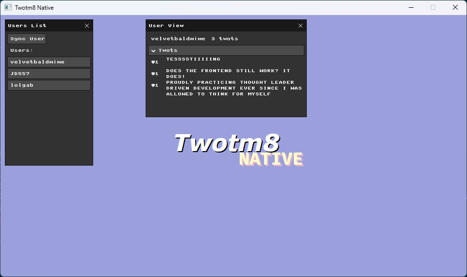

# Twotm8 Native

This repo contains an example graphical application in [Scala Native](https://scala-native.org), using [microui](https://github.com/rxi/microui).

The backend is abstracted away in a `Backend` trait (with an example `MinartBackend` powered by [minart](https://github.com/jd557/minart)), so it should be pretty simple to bring your own implementation.

The application connects to [Twotm8](https://github.com/keynmol/twotm8) and shows the posts from a few predefined profiles.

## Notes:

The default `MinartBackend` expects `libSDL` to be installed.

The `LibCurlHttp` HTTP client requires `libcurl` to be installed.
If for some reason you have problems linking `libcurl`, there's a naive `BinCurlHttp` client that calls the `curl` executable. You can use it by simply updating the `TwotM8Native.scala` to use that client instead.

The microui bindings come from https://github.com/keynmol/microuilib-scala-native-demo
